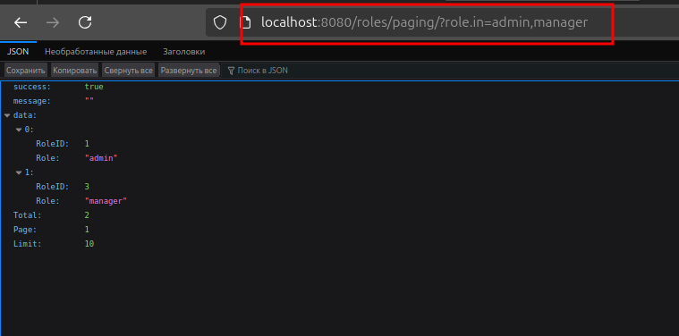

# Технологии создания программного обеспечения
## Задание 10.1. Работа с транзакциями и сложными запросами в GORM.

### Запуск
```
go run main.go
```


### Транзакции

Пример для **Roles** (штатная ситуация)


Пример для **Roles** (ошибка)


### Сложные запросы

На самом деле сложные запросы уже были реализованы в одной из предыдущих работ.


Пример для **Roles**

