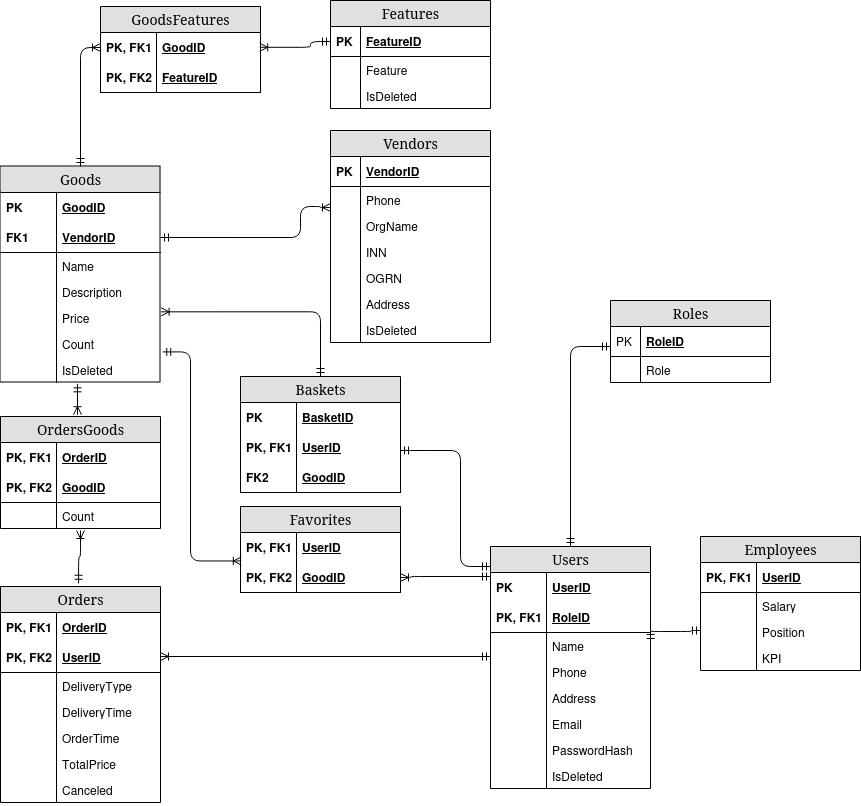

# Технологии создания программного обеспечения
## Задание 1.2. ERD-диаграмма онлайн магазина

### Основные сущности:
- **Goods** - товары. Отражает все товары и их основные параметры;
- **Features** - характеристики товаров. Отражает набор характеристик товара;
- **Vendors** - поставщики товаров. Отражает информацию о потсавщиках товаров;
- **Users** - пользователи. Отражает всех пользователей системы;
- **Employees** - работники ("наслдедуются" от пользователей). Отражает работников магазина;
- **Orders** - заказы. Отражает множества товаров, заказанные пользователями;
- **Roles** - роли пользователей. Отражает роли пользователей (например, постоянный покупатель);
- **Favorites** - избранное. Отражает список избранных товаров пользователей;
- **Baskets** - корзины. Отражает корзины пользователей.

