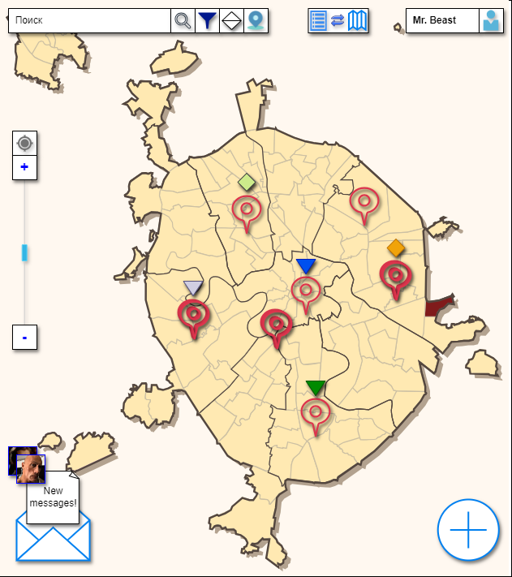
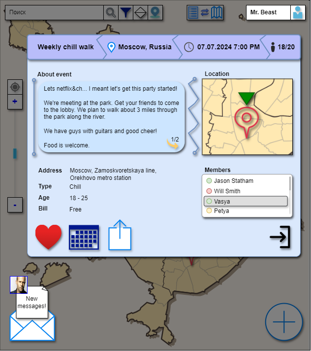
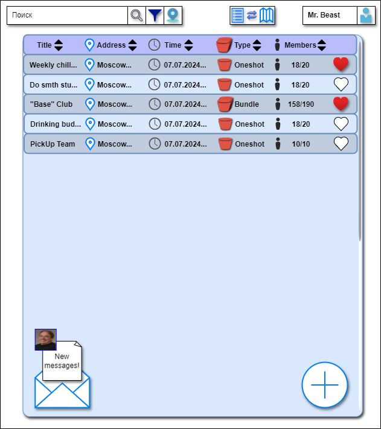

# Технологии создания программного обеспечения
## Задание 1.1. Описание ЖЦ проекта

### Проект - **LikeMind**

### 1. Идея
Кроссплатформенное приложение для быстрого создания и поиска мероприятий с отметкой на карте и лобби.

### 2. Методология разработки и окружение
Придерживаться **Agile**.

Выбор пал на, пожалуй, самую распространненую методологию, ввиду её гибкости / адаптивности к изменениям. Поскольку проект находится на стадии зарождения, то он с высокой вероятностью будет подвержен каким-либо изменениям в будущем.

**Окружение**:
- Atlassian Stack (Jira, Confluence);
- GitHub.

### 3. Шаги

### 3.1 Формирование требований

**Общая архитектура приложения** - **микросервисная** архитектура. При этом каждый микросервис внутри себя может придерживаться любого архитектурного паттерна.

**Подходы:**

- **Microservices** (микросервисы/сервисы);
- **REST API** как стандарт для протоколов взаимодействия;
- **Backends for Frontends & Service Discovery** как точки входа;
- У каждого сервиса своя **экосистема** (БД, реплики, балансировщик и т.д.);
- **Отслеживание** запросов к сервисам (tracing);
- **Отслеживание** здоровья (health checking);
- **Логирование** действий (logging);
- К каждому сервису **документация** в **OpenAPI**;
- Внутренняя (межсервисная) **аутентификация** по **JWT**;
- **SSO** (с интеграциями известных сервисов);
- Взаимодействие с пользователями **по** **сессиям**.

Стек технологий конкретного компонента выбирает его **лид** по согласованию с **основателем** на общем **синке**.

1) Точки входа - **Backends for Frontends & Service Discovery**;
2) Сервис **мониторинга** (logging + health checking + tracing);
3) **Микросервисы**:
    - Авторизация;
    - Мессенджер;
    - Ивенты.
4) **Фронтенд + Точка входа:**
    - Web-Front + Web-BFF;
    - Andoird-Front + Android-BFF;
    - IOS-Front + IOS-BFF.

### 3.2 Распределение по итерациям

Распределение будет составляться в соответствии с полным списком фич, который будет составляться отдельно.

### 3.3 Дизайн

В качестве дизайна представлен UX-дизайн. UI может отличаться графически.

#### Главная страница:

#### Выбранный ивент:

#### Список ивентов:

### 3.4 Разработка

Разработка будет вестись итеративно согласно фичам в конкретной итерации. 

### 3.5 Тестирование

### 3.6 Развертывание

Предварительный способ развертывания - **Docker Compose**.

