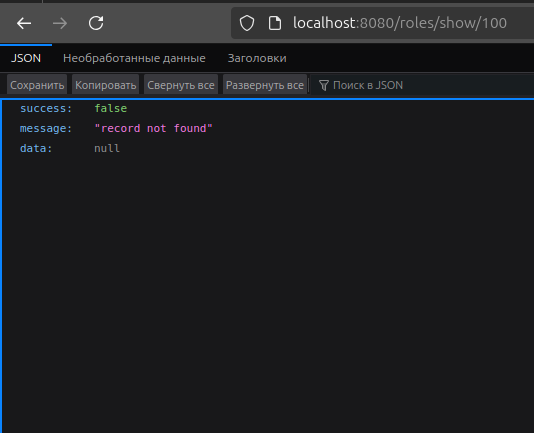
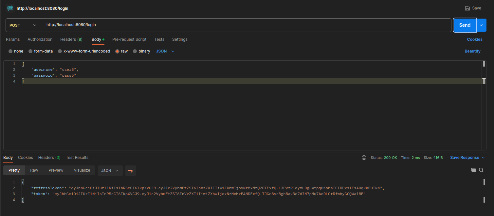
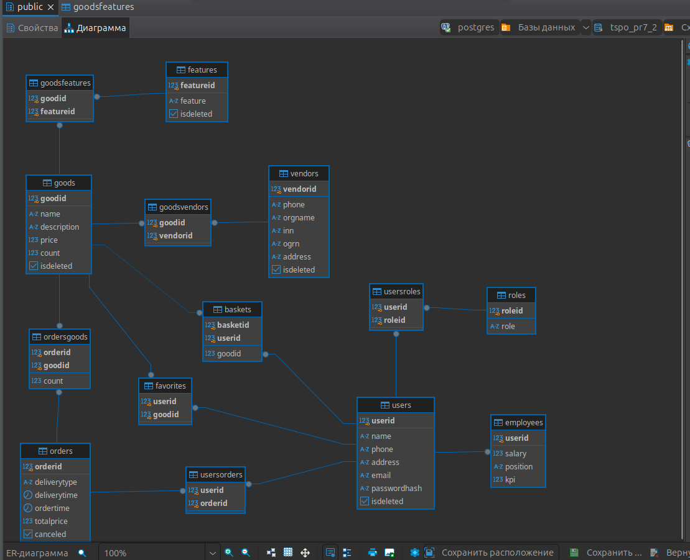
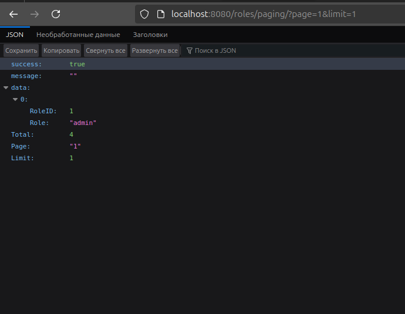
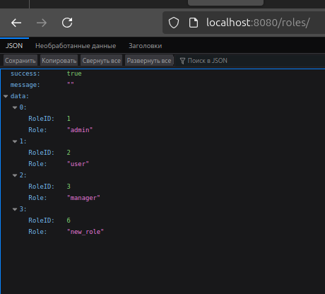
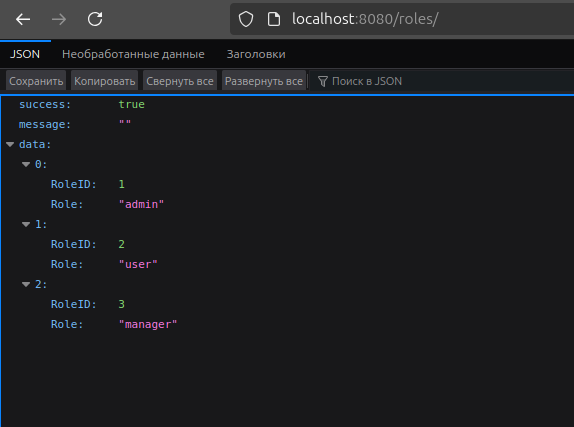
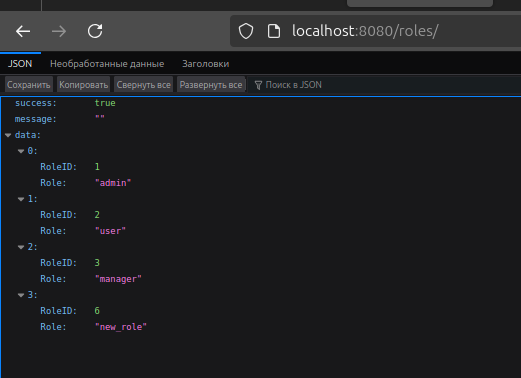
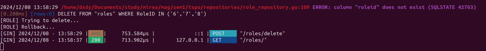
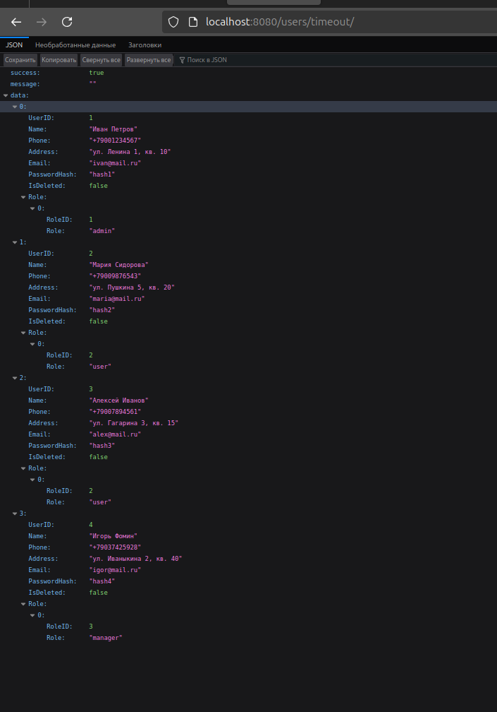

# Технологии создания программного обеспечения
## Задание 8.1. Интеграция REST API с базой данных (PostgreSQL) на Go.

### Запуск
```
go run main.go
```

### Описание

По ранее созданной схеме базы данных был составлен CRUD-сервис, в котором были реализованы CRUD-операции для таблиц **Users**, **Goods**, **Roles**, **Features**, **Employees**, **Vendors**, **Orders**.

### Пример GET-запроса для товаров




### Пример GET-запроса для одного товара



### Пример POST-запроса на создание роли





### Пример DELETE-запроса на удаление роли





### Пример PUT-запроса на изменение роли





