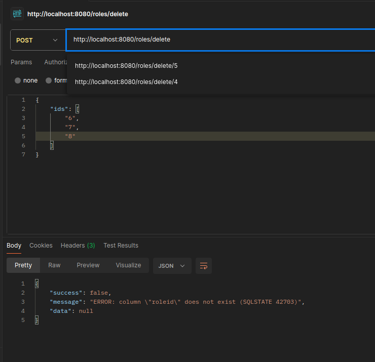

# Технологии создания программного обеспечения
## Задание 8.1. Интеграция REST API с базой данных (PostgreSQL) на Go.

### Запуск
```
go run main.go
```

### Описание

По ранее созданной схеме базы данных был составлен CRUD-сервис, в котором были реализованы CRUD-операции для таблиц **Users**, **Goods**, **Roles**, **Features**, **Employees**, **Vendors**, **Orders**.

### Пример GET-запроса для товаров


### Пример GET-запроса для одного товара


### Пример POST-запроса на создание роли


### Пример DELETE-запроса на удаление роли




### Пример PUT-запроса на изменение роли


