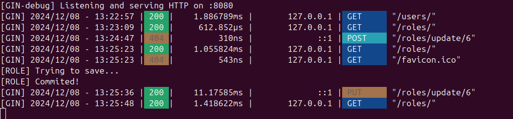
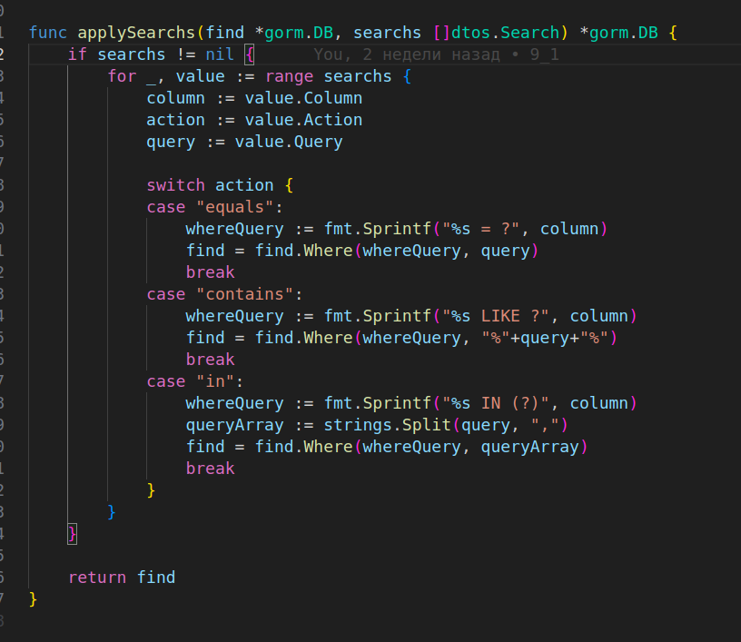

# Технологии создания программного обеспечения
## Задание 9.1. Обработка ошибок, пагинация и фильтрация данных в REST API.

### Запуск
```
go run main.go
```

### Описание

На самом деле реализация обработки ошибок уже была введена в предыдущей работе, например:


### Пагинация

Пример для **Roles**





### Сортировка

Пример для **Users**


### Фильтрация

Пример для **Users**


### Тайм-ауты

Пример для **Users**
Ситуация совпадает с обычном запросом, т.к. ситуация штатная.

