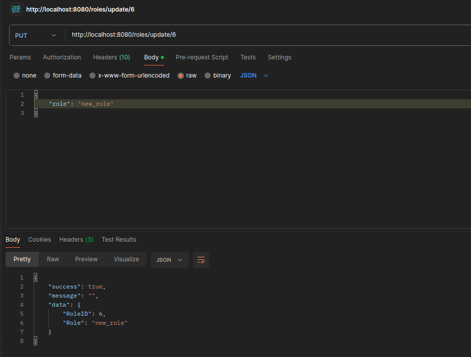
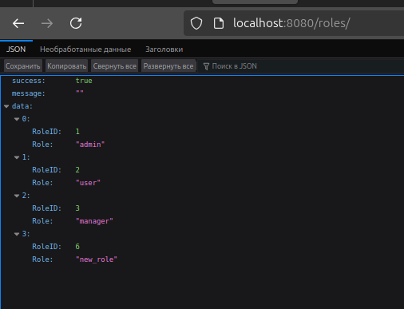

# Технологии создания программного обеспечения
## Задание 6.1

### OpenAPI
Генерации документации в OpenAPI производится из комментариев в исходном коде **Golang** с помощью **swag**.

### Генерация API
Генерация API производится командой
```
swag init
```

### Тест
Запуск производится командой
```
go run main.go
```

### Endpoints
* http://localhost:8080/swagger/ - Swagger WebUI
* http://localhost:8080/books/ - Книги
* http://localhost:8080/cities/ - Города
* http://localhost:8080/genres/ - Жанры
* http://localhost:8080/publishingHouses/ - Издательства

### Отображение API


