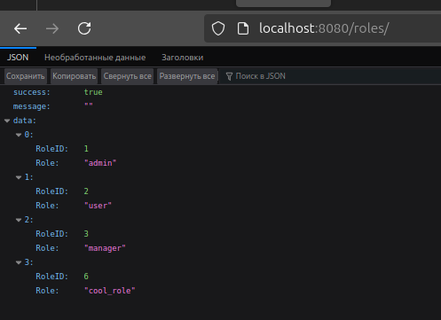

# Технологии создания программного обеспечения
## Задание 7.2. Создание и заполнение БД (PostgreSQL) согласно ERD из задания 1.2.

### ERD из задания 1.2.

### Таблицы из ERD:
- **Goods** - товары. Отражает все товары и их основные параметры;
- **GoodsFeatures** - связка для товаров и их характеристик;
- **Features** - характеристики товаров. Отражает набор характеристик товара;
- **Vendors** - поставщики товаров. Отражает информацию о потсавщиках товаров;
- **Users** - пользователи. Отражает всех пользователей системы;
- **Employees** - работники ("наслдедуются" от пользователей). Отражает работников магазина;
- **Orders** - заказы. Отражает множества товаров, заказанные пользователями;
- **OrdersGoods** - связка для заказов и товаров;
- **Roles** - роли пользователей. Отражает роли пользователей (например, постоянный покупатель);
- **Favorites** - избранное. Отражает список избранных товаров пользователей;
- **Baskets** - корзины. Отражает корзины пользователей.

### SQL
**При создании таблиц были совершены минорные корректировки в схеме для адаптации к SQL-запросам.**

**Новая схема:**

**SQL-скрипт создания таблиц [представлен здесь](init.sql)**

**SQL-скрипт заполнения [представлен здесь](insert.sql)**

### Результаты
Таблица созданы и заполнены данными.

**Пример для товаров:**
